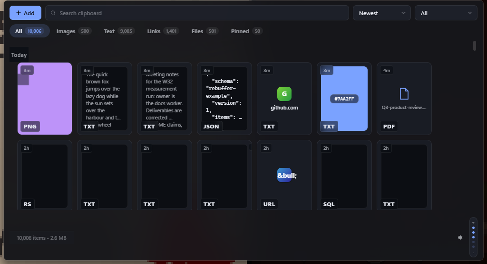
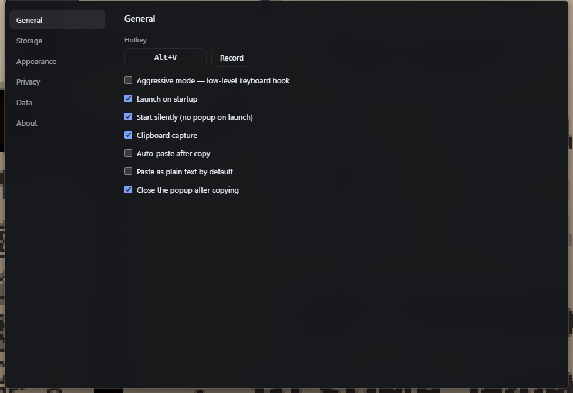

# Rebuffer

> A fast, persistent clipboard history for Windows. Everything you copy stays for 30 days — text, images, GIFs, videos, files — and comes back with one hotkey.



Rebuffer is a replacement for the built-in Windows `Win+V` clipboard history: a dark liquid-glass interface, 30-day persistence across reboots, search, sorting, filters, pinning, and a manual "shelf" where you can park files you use often.

---

## Status

**Shipped:** clipboard capture (text, rich text, images, video, files), duplicate bumping, privacy-flag filtering and a per-app blocklist, the `Alt+V` popup, the virtualized card grid with day grouping and a zoom dial, tabs, search/sort/filter, pinning, keyboard navigation, click-to-copy and optional auto-paste, drag-out into other apps, the shelf (`+ Add` stores references), the right-click menu, retention janitor, storage cap, tray with Settings / Enable-Disable, silent autostart, the settings window, and export/import of history and settings.

**Measured and passing** (on DESKTOP-0MFACBN — AMD Ryzen 7 7800X3D, Windows 11, debug build; recorded in `docs/PERF.md` and `docs/DECISIONS.md`):

| Metric | Measured | Target |
|---|---|---|
| Hotkey → window visible | **4.1 ms median** (worst 7.0 ms) | < 80 ms |
| Idle RAM, main process | **45.8 MB median** | < 60 MB |
| Idle CPU | **0 %** (max 0.36 % of one core) | 0 % |
| 200-item store page at 10,000 items | **≈ 0.9 ms** | < 10 ms |
| Cold start to tray-ready, 10,000-item store | **1.13 s** | < 1.5 s |
| Startup integrity sweep, 10,000 items | **151 ms** (release) | — |

**Known issues and untested ground** are listed honestly in
[`docs/KNOWN-ISSUES.md`](docs/KNOWN-ISSUES.md) — including what was verified
only by reading rather than by running.

---

## Install

Grab `Rebuffer_x.y.z_x64-setup.exe` from the
[latest release](../../releases/latest) and run it.

The installer offers one option, unticked by default: **disable Windows'
own clipboard history (Win+V)**, so the two do not compete. It writes a
single per-user registry value and the uninstaller offers to put it back —
but only if the installer was the one that changed it. The same switch lives
in Settings → General, so you can change your mind later.
See [`docs/INSTALLER.md`](docs/INSTALLER.md).

> **SmartScreen will warn on first run.** The build is not code-signed —
> certificates cost money this project does not have. Choose *More info →
> Run anyway*, or build it yourself with the steps below.

---

## Features

**Capture**
- Records every clipboard change: Unicode text, rich text (HTML/RTF), images (PNG/JPG/GIF/WebP/BMP), videos, and file references
- Survives reboots, crashes, and force-kills — nothing is buffered in memory waiting to be written
- Duplicate detection: copying the same thing again bumps the existing entry to the top instead of creating a clone
- Respects clipboard privacy flags, so password managers never end up in your history
- Per-application blocklist for anything else you don't want recorded

**Browse**
- Opens next to your cursor, clamped so the window always fits on the monitor you opened it on
- Grid of cards with a zoom dial you can drag or scroll (`Ctrl`+wheel also zooms)
- Grouped by day (Today, Yesterday, specific dates), like Explorer's date grouping
- Tabs: All / Images / Text / Links / Files / Pinned
- Search, sort (name, size, newest, oldest), and filter by type or exact extension
- Relative age badge on each card (`14m`, `3h`, `4d`)
- Format label on each card (`PNG`, `TXT`, `MP4`)
- Full keyboard navigation — arrows, Enter, Esc, Ctrl/Shift multi-select
- Pin anything to keep it past the auto-clean window

**Use**
- Click to copy back to the clipboard, or enable auto-paste to drop it straight into whatever you were typing in
- Drag items out into Explorer or any other app
- Add files manually with the **+** button — those are stored by reference and never expire
- Right-click menu: Open, Open with, Save as, Show in folder, Rename, Pin, Delete

**Manage**
- Auto-clean after 1–30 days (configurable)
- Optional storage cap — when the store exceeds your limit, the oldest unpinned items are removed and you get a notification
- Tray icon with two entries: Settings, and Enable/Disable (left-click opens the popup)
- Silent autostart with Windows
- Export/import of history and settings



---

**Appearance**

- Eleven themes: dark blue, black, grey, light, sky blue, dark green, dark
  purple, ember, ocean, wine and paper — each with its own accent, picked from
  a strip of live previews that paint themselves in the theme they name
- Any accent can be overridden per taste, or left to follow the theme
- Zoom dial, configurable card badges, reduced-motion honoured

---

## Stack

| Layer | Choice | Why |
|---|---|---|
| Shell | Tauri 2 | Native window; idle RAM measured at 45.8 MB for the main process |
| Backend | Rust | Direct WinAPI access for clipboard, hooks, and paste injection |
| Frontend | Svelte 5 + TypeScript + Vite | Hotkey-to-visible measured at 4.1 ms median (target 80 ms) |
| Database | SQLite (WAL) via `rusqlite` | Crash-safe metadata + FTS5 full-text search |
| Blobs | Content-addressed files on disk | Large items don't belong in a database row; thumbnails as WebP |

Windows only. Developed and tested on Windows 11; a Windows 10 flat-backdrop fallback exists but has not yet been run on real Windows 10 hardware.

Key crates: `windows`, `arboard`, `rusqlite`, `image`, `webp`, `blake3`, `zip`, `walkdir`, `urlencoding`, `window-vibrancy`, and the Tauri plugins (`global-shortcut`, `autostart`, `single-instance`, `notification`, `dialog`, `opener`). The full list lives in `src-tauri/Cargo.toml`.

---

## Getting started

### Prerequisites

1. **Rust** — install via [rustup](https://rustup.rs/), stable toolchain, `x86_64-pc-windows-msvc`
2. **Visual Studio Build Tools 2022** with the *Desktop development with C++* workload (Tauri needs the MSVC linker)
3. **Node.js 20+** and npm
4. **WebView2 Runtime** — preinstalled on Windows 11; on Windows 10 grab the Evergreen Bootstrapper from Microsoft

Verify:

```powershell
rustc --version
node --version
```

### Setup

```powershell
git clone https://github.com/<you>/rebuffer.git
cd rebuffer
npm install
npm run tauri dev
```

### Build a release installer

```powershell
npm run tauri build
```

Output lands in `src-tauri/target/release/bundle/nsis/`. The build is unsigned, so SmartScreen will warn on first run — that's expected for an unsigned open-source binary.

---

## Project layout

```
rebuffer/
├─ index.html / settings.html  # the two Vite entry points (popup and settings)
├─ src/                        # Svelte frontend
│  ├─ popup.ts / settings.ts   # entry scripts for the two pages
│  └─ lib/styles/themes/       # one file per theme, 36 colour tokens each
│  ├─ routes/
│  │  ├─ Popup.svelte          # the Alt+V window
│  │  └─ Settings.svelte       # settings window
│  ├─ lib/
│  │  ├─ components/           # Card, Grid, Tabs, ZoomDial, ContextMenu, ...
│  │  ├─ stores/               # items, settings, selection
│  │  └─ styles/               # global.css, tokens.css
│  └─ ipc.ts                   # the only file that talks to the backend
├─ src-tauri/
│  ├─ src/
│  │  ├─ main.rs / lib.rs
│  │  ├─ capture.rs            # clipboard capture
│  │  ├─ clipboard/            # decoders, writer
│  │  ├─ hotkey/               # RegisterHotKey + optional LL hook
│  │  ├─ store/                # SQLite, blob store, janitor
│  │  ├─ window/               # positioning, vibrancy, paste injection
│  │  ├─ settings.rs / tray.rs / commands.rs / logging.rs / model.rs
│  ├─ migrations/              # schema (0001_init.sql)
│  └─ tauri.conf.json
├─ docs/                       # SPEC, ROADMAP, DECISIONS, PERF, THEMES, ...
├─ tools/gen_themes.py         # generates a theme's 36 tokens consistently
└─ README.md
```

---

## Data location

```
%APPDATA%\Rebuffer\
├─ rebuffer.db          # metadata + search index (+ -wal / -shm)
├─ settings.json
├─ logs\                # rotating tracing logs
└─ blobs\
   ├─ ab\cd\abcd1234…   # content-addressed originals
   └─ thumbs\           # WebP previews
```

The store folder is configurable in Settings; changing it migrates existing data.

⚠️ **Your clipboard history is sensitive.** It sits in your user profile, protected by Windows file permissions, but it is not encrypted by default. Don't sync this folder to a shared drive.

---

## License

MIT — see [`LICENSE`](LICENSE).